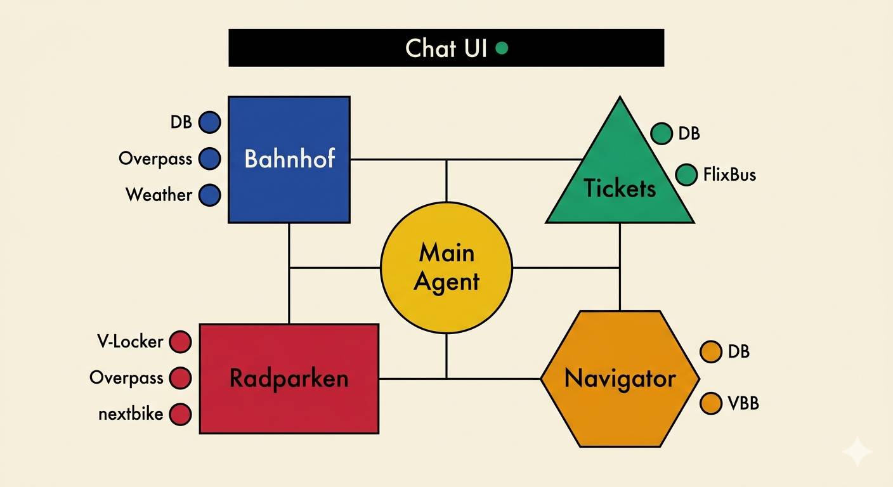
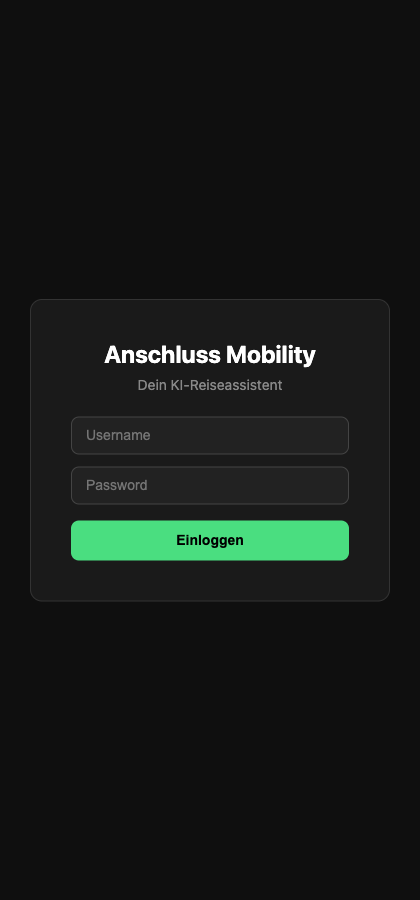
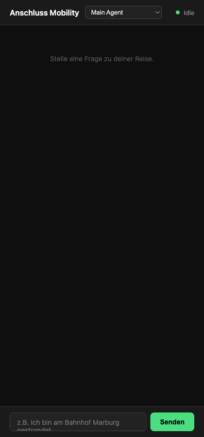
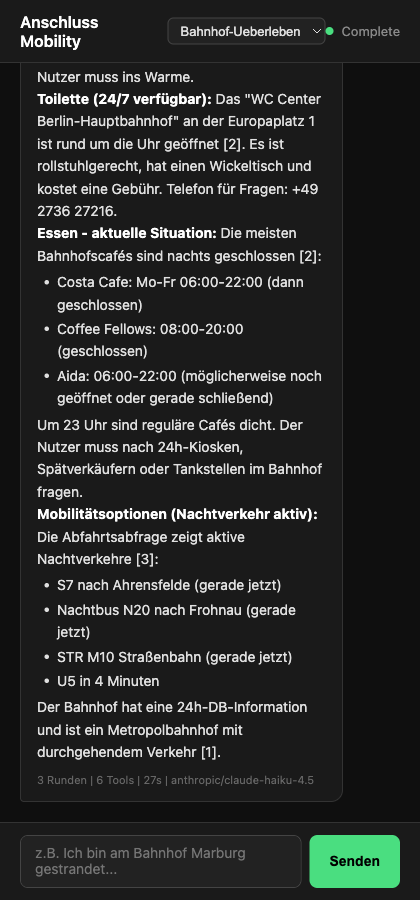

# Anschluss Mobility

> Multi-Agent KI-Reiseassistent fuer die erste und letzte Meile rund um Bahnhoefe — gebaut beim **"Anschluss erreichen" Hackathon** (BMV, DB InfraGO, DB mindbox), Berlin Hauptbahnhof, 20.–21. Maerz 2026.



---

## Was ist das?

Ein Chat-basierter Reiseassistent der **echte Mobilitaetsdaten** aus 9 APIs kombiniert. Fuenf spezialisierte KI-Agenten beantworten Fragen zu Zugverbindungen, Radparken, Tickets und Notfallsituationen — mit Live-Daten, nicht mit halluzinierten Antworten.

**Challenge 1 — Mobilitaetsdaten:**
> "Wie koennen Mobilitaetsdaten helfen, Wege und Services entlang der ersten und letzten Meile rund um Bahnhoefe verlaesslich zu planen?"

---

## Screenshots

<table>
<tr>
<td></td>
<td></td>
<td></td>
</tr>
<tr>
<td align="center"><b>Login</b></td>
<td align="center"><b>Chat UI</b></td>
<td align="center"><b>Agent-Antwort mit Live-Daten</b></td>
</tr>
</table>

---

## Agenten

| Agent | Aufgabe | Tools | Model |
|-------|---------|-------|-------|
| **Main** | Routing — leitet Anfragen an den richtigen Sub-Agenten | 4 Sub-Agenten | Sonnet |
| **Bahnhof-Ueberleben** | Gestrandet am Bahnhof? Toilette, Essen, Hotel, naechste Zuege | Overpass, DB, Wetter, Nominatim | Haiku |
| **Ticketkauf** | Preisvergleich DB vs. FlixBus | DB, FlixBus | Haiku |
| **Radparken** | V-Locker, Radbuegel, nextbike, Infrastruktur | V-Locker, Overpass, nextbike, infraVelo | Haiku |
| **Navigator** | Anschluss-Check bei Verspaetung — erreichbar/knapp/verpasst | DB, VBB, Wetter | Haiku |

---

## Datenquellen (9 APIs, 27 Tools)

| API | Daten | Auth |
|-----|-------|------|
| [transport.rest (DB)](https://transport.rest) | Fahrplan, Abfahrten, Stationen | Keine |
| [transport.rest (VBB)](https://transport.rest) | Berlin/Brandenburg OEPNV | Keine |
| [Overpass / OSM](https://overpass-api.de) | Radparkplaetze, Toiletten, Hotels | Keine |
| [BrightSky (DWD)](https://brightsky.dev) | Wetter Deutschland | Keine |
| [Nominatim](https://nominatim.org) | Geocoding | Keine |
| [nextbike](https://api.nextbike.net) | Bike-Sharing Stationen | Keine |
| [infraVelo](https://www.infravelo.de) | Berliner Radinfrastruktur-Projekte | Keine |
| [FlixBus](https://global.api.flixbus.com) | Fernbus-Verbindungen + Preise | Keine |
| [V-Locker](https://live.v-locker.ch) | Sichere Fahrradboxen (17 Standorte) | Keine |

Alle APIs sind oeffentlich und benoetigen keinen API-Key.

---

## Architektur

```
Chat UI (Dark Mode)
  |
  POST /api/login → Session Cookie
  |
  POST /mcp/{agent} → MCP Streamable HTTP
  |
  ┌──────────────────────────────────────────┐
  │  Main Agent (Sonnet)                     │
  │  → Klassifiziert Anfrage                 │
  │  → Delegiert an Sub-Agent                │
  └──────┬──────┬──────┬──────┬──────────────┘
         │      │      │      │
    Bahnhof  Tickets  Rad   Navigator
    (Haiku)  (Haiku) parken  (Haiku)
                     (Haiku)
         │      │      │      │
    ┌────┴──────┴──────┴──────┴────┐
    │  FlowMCP Schema Tools (27)   │
    │  9 APIs → Echte Live-Daten   │
    └──────────────────────────────┘
```

**Stack:**
- **Server:** Node.js 22 + Express
- **MCP:** [mcp-agent-server](https://github.com/FlowMCP/mcp-agent-server) (Streamable HTTP)
- **Schemas:** [FlowMCP](https://github.com/FlowMCP/flowmcp-core) v3.0.0
- **LLM:** Claude via OpenRouter (Sonnet fuer Main, Haiku fuer Sub-Agenten)
- **Frontend:** Vanilla HTML/JS, Leaflet.js fuer Karten, marked.js fuer Markdown

---

## Quickstart

```bash
# 1. Clone
git clone https://github.com/a6b8/hackathon-anschluss-erreichen.git
cd hackathon-anschluss-erreichen

# 2. Dependencies
npm install

# 3. Environment (im Parent-Verzeichnis)
cat > ../.hackathon.env << 'EOF'
LLM_BASE_URL=https://openrouter.ai/api
LLM_API_KEY=your-openrouter-key
LOGIN_USER=hackathon
LOGIN_PASS=anschluss2026
EOF

# 4. Start
npm run start:dev

# 5. Open
open http://localhost:4100/chat-ui.html
```

---

## Demo-Szenarien

### 1. Gestrandet am Bahnhof (Bahnhof-Ueberleben)
> "Ich bin am Berlin Hbf gestrandet, 23 Uhr. Wo finde ich Toilette und Essen?"

Agent ruft Overpass, DB Abfahrten und Wetter ab → zeigt 24h-Toilette, offene Restaurants, Nachtverkehr.

### 2. Radparken mit V-Locker (Radparken)
> "Gibt es einen V-Locker am Bahnhof Halle?"

Agent ruft V-Locker API ab → "DB Halle: 6/12 Boxen frei, 1 EUR/24h" + OSM Radbuegel als Alternative.

### 3. Anschluss-Check bei Verspaetung (Navigator)
> "RE1 hat 10 Min Verspaetung, schaffe ich die S1 an der Friedrichstrasse?"

Agent ruft DB Abfahrten ab → "VERPASST: Ankunft 01:56 > Abfahrt S1 01:52. Naechste S1 in 20 Min."

### 4. Ticket-Preisvergleich (Ticketkauf)
> "Was kostet Berlin nach Hamburg morgen um 8 Uhr?"

Agent vergleicht DB und FlixBus Preise in einer Tabelle.

---

## Testfelder

| Station | Region | Besonderheit |
|---------|--------|--------------|
| Berlin Hauptbahnhof | Berlin | Groesste Datenvielfalt |
| S+U Jannowitzbruecke | Berlin | Typischer Umsteigepunkt |
| Potsdam Hbf | Brandenburg | RE1-Anbindung |
| Bad Belzig | Brandenburg | Laendlicher Raum |

---

## Projektstruktur

```
hackathon-anschluss-erreichen/
├── server.mjs                    # Express + MCP Server
├── public/
│   └── chat-ui.html              # Dark-Mode Chat UI
├── agents/
│   ├── anschluss-mobility/       # Main Agent (Router)
│   ├── bahnhofs-ueberleben/      # Notfall-Assistent
│   ├── ticketkauf/               # Preisvergleich
│   ├── radparken/                # Radparken + V-Locker
│   │   └── schemas/vlocker.mjs   # V-Locker FlowMCP Schema
│   └── anschluss-navigator/      # Echtzeit Anschluss-Check
├── lib/
│   ├── EnvironmentManager.mjs    # Config aus .env
│   ├── schema-loader.mjs         # FlowMCP Schema Loader
│   └── manifest-loader.mjs       # Agent Manifest Loader
└── docs/
    ├── overview.png              # Bauhaus Architektur-Diagramm
    └── screenshots/              # UI Screenshots
```

---

## Team

Gebaut beim "Anschluss erreichen" Hackathon, 20.–21. Maerz 2026.

**Powered by** [FlowMCP](https://github.com/FlowMCP) — Open-Source MCP Schema Tools fuer LLM Agenten.

---

## Lizenz

MIT
